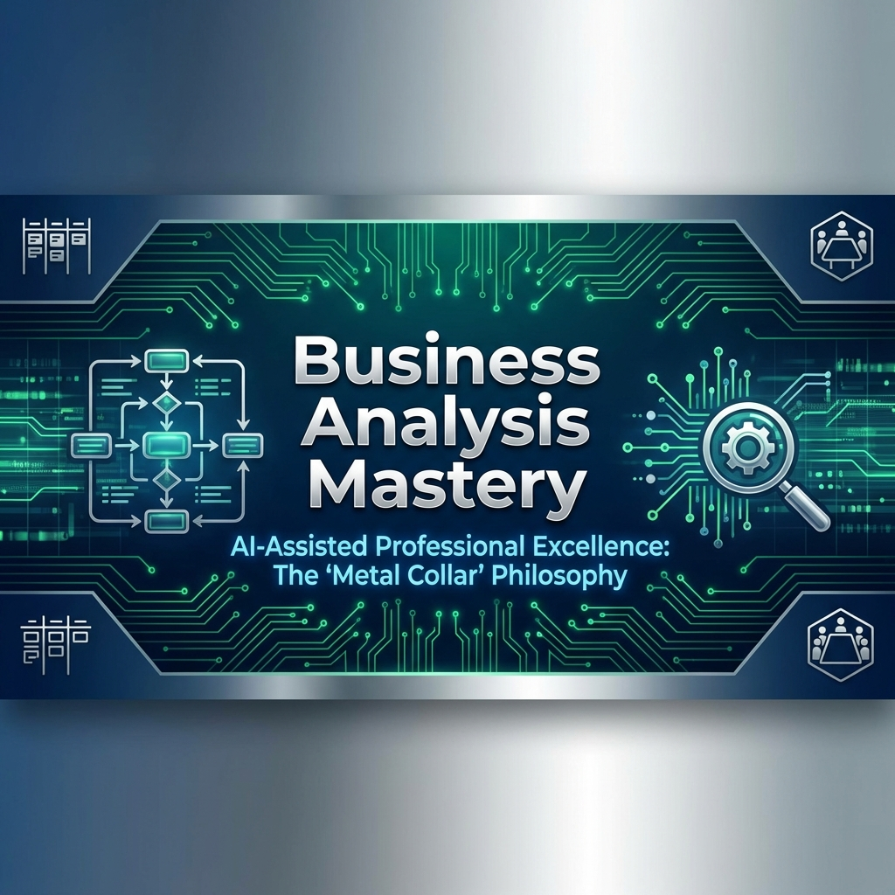



# 🦅 Business Analysis Mastery: Dijital Dönüşümün Mimarları

> **"Kaosun ortasında düzeni kuran, soyut gereksinimleri somut sistemlere dönüştüren zihinlerin sığınağı."**

## 📜 Manifesto

Bu depo, modern iş dünyasının en kritik cephelerinden birinde, **Analiz ve Strateji** hattında savaşan profesyoneller için inşa edilmiş bir kaledir. Literatürde kaybolmuş sıradan bir ders notu koleksiyonu veya internetin tozlu raflarında unutulacak teorik bir bilgi yığını değildir. Burası, **Modern İş Analistinin (Business Analyst)** sahadaki en keskin silahı, zihinsel cephaneliği ve stratejik rehberidir.

Teknoloji dünyasının baş döndürücü hızı ile iş dünyasının katı gerçekleri arasındaki o tehlikeli uçurumun üzerinde duran, her iki tarafın dilini de ana dili gibi konuşabilen ve meselelere **"Metal Yaka" (Metal Collar)** felsefesinin disipliniyle yaklaşan profesyonellerin toplanma alanıdır.

Bizler, sadece toplantı notu alan veya belge dolduran ofis çalışanları değiliz. Bizler, karmaşık problemleri parçalara ayıran, **sistem inşa eden**, tıkanmış **süreçleri iyileştiren** ve organizasyonlar için gerçek, ölçülebilir **değer üreten** mimarlarız. Verinin soğuk mantığı, gereksinimlerin belirsiz doğası ve insan psikolojisinin karmaşıklığının tam kesişim noktasında dururuz; ve tam orada, kaostan düzen yaratırız. Bir yazılımcı "nasıl" yapılacağını, bir yönetici "ne" zaman biteceğini düşünürken; biz "neden" yapıldığını ve "değerin" nerede olduğunu sorgulayanlarız.

---

## 🎯 Hedef Kitle (Who is this for?)

Bu dokümantasyon herkes için değildir. Sadece **"işin mutfağına"** girmeye cesaret edenler içindir:

*   **Junior Business Analysts:** Teorik bilgiyi pratik sahadaki "savaş sanatı"na dönüştürmek isteyenler.
*   **Teknik Kökenliler (Developers/QA):** Kodun ötesini görüp, "neden" sorusunun cevabını arayan ve iş dünyasına köprü kurmak isteyenler.
*   **Yönetim Kökenliler (PM/PO):** Teknik ekiplerle aynı dili konuşmak ve projeleri daha realist zeminlere oturtmak isteyenler.
*   **Kariyer Değiştirenler:** Farklı bir disiplinden gelip, analitik zekasını iş dünyasının problemlerine kanalize etmek isteyen cesur zihinler.

## 🎓 Eğitim Metodolojisi (The Method)

Burada "ezber" yoktur, "içselleştirme" vardır. Metodolojimiz üç aşamalı bir döngüden oluşur:

1.  **Kavramsal İnşa (Construct):** Önce zihinsel modeli kurarız. Neden bu kavrama ihtiyacımız var? Hangi problemi çözüyor?
2.  **Pratik Uygulama (Deploy):** Teoriyi sahaya indiririz. Gerçek dünya senaryoları, vaka analizleri ve canlı örnekler.
3.  **Araçsal Hakimiyet (Master):** İşi yapmak için gereken dijital araçları (Jira, SQL, BPMN tools) bir uzvumuz gibi kullanmayı öğreniriz.

---

## 🏆 Ultimate Certification Hub: Küresel Geçerlilik

Bu repo, sizi rastgele bilgilerle değil, **IIBA® (International Institute of Business Analysis)** standartlarıyla donatır. Hedefimiz sadece öğrenmeniz değil, yetkinliğinizi küresel arenada tescilleyen sertifikaları (ECBA™, CCBA®, CBAP®) kazanmanızdır.

### �️ Rütbe ve Yetkinlik Tablosu (Hangisi Senin İçin?)

| Sertifika | Seviye | Hedef Kitle | Deneyim Şartı | Sınav Odağı |
| :--- | :--- | :--- | :--- | :--- |
| **ECBA™** | Çırak (Entry) | Yeni Mezunlar, Junior BA'ler | **Yok** (0 Saat) | Temel Bilgi & Kavramlar |
| **CCBA®** | Kalfa (Mid) | 2-3 Yıl Deneyimliler | **3,750 Saat** | Senaryo Analizi & Uygulama |
| **CBAP®** | Usta (Senior) | 5+ Yıl Deneyimliler | **7,500 Saat** | Stratejik Vaka Çözümü |

> **💡 Metal Yaka Notu:** Sertifika bir kağıt parçası değil, "Ben bu işin kitabını yazdım ve sahada uyguladım" demenin en kısa yoludur.

---

## 🗺️ İçerik Haritası & BABOK® Eşleşmeleri

Bu yolculuk, mesleğin temellerini atan kavramsal bir girişten başlayıp, karmaşık sistemleri yönetmenizi sağlayacak ileri seviye tekniklere ve stratejik derinliğe kadar uzanan kapsamlı bir "Mastery Path" yani ustalık yoludur. Her modül, sizi bir sonraki seviyeye hazırlayan bir basamaktır.

### 🏛️ [01_Temel_Kavramlar](./01_Temel_Kavramlar/)
**"Kökeni Anlamak"**
Her büyük yapı, sarsılmaz bir temel üzerine kurulur. İş analizinin DNA'sını incelediğimiz bu bölümde, sadece tanımları değil, mesleğin ruhunu ve varoluş amacını kavrarsınız. Bir analist organizasyonda nerede durur, kime hizmet eder ve başarısı nasıl ölçülür? Paydaşlarla (stakeholders) kurulan o hassas iletişim dengesinden, politik manevra kabiliyetine; bir iş analistinin sahip olması gereken analitik zeka ve eleştirel düşünme yetkinliklerine kadar her şeyi burada inşa ediyoruz. Burası, "neden buradayım" sorusunun cevabıdır.
*   *Odak Noktaları: Analistin Stratejik Rolü, Paydaş Analizi ve Yönetimi, Temel Yetkinlikler, IIBA ve BABOK Standartlarına Giriş, Analitik Zihniyetin İnşası.*
*   *🗝️ BABOK Mapping: Chapter 1 & 2 (Key Concepts), Chapter 9 (Underlying Competencies)*

### 📐 [02_Gereksinim_Muhendisligi](./02_Gereksinim_Muhendisligi/)
**"Görünmeyeni İnşa Etmek"**
Müşterinin ne istediği ile neye ihtiyacı olduğu arasındaki uçurumu kapatmak, bu işin en büyük sanatıdır. Çoğu proje, kodlama hatalarından değil, yanlış anlaşılmış gereksinimlerden dolayı batar. Bu bölüm, görünmeyeni görünür kılma, söylenmeyeni duyma sanatıdır. Gereksinim toplama (elicitation) teknikleriyle sahaya inip, ham bilgiyi işleyerek, yazılım ekiplerinin üzerinde çalışabileceği net, hatasız ve uygulanabilir teknik dokümanlara dönüştürme sürecini, yani gerçek bir **mühendisliği** öğrenirsiniz.
*   *Odak Noktaları: Gereksinim Çıkarımı (Elicitation - Mülakat, Çalıştay, Gözlem), Analiz Derinliği, Teknik Dokümantasyon (BRD, SRS), Doğrulama ve Onay Süreçleri, Gereksinimlerin Yaşam Döngüsü Yönetimi.*
*   *🗝️ BABOK Mapping: Knowledge Area 4 (Elicitation and Collaboration) & Knowledge Area 5 (Requirements Life Cycle Management)*

### 🔄 [03_Surec_Modelleme](./03_Surec_Modelleme/)
**"Akışı Yönetmek"**
Bir organizasyonun kalp atışlarını görebilmek için onun damarlarındaki akışı haritalamanız gerekir. Sözlü anlatımlar havada kalır, yazı yanlış yorumlanır; ancak şemalar evrenseldir. Süreç modelleme, karmaşık iş operasyonlarını evrensel bir dille görselleştirme yeteneğidir. BPMN 2.0 standartlarını kullanarak, mevcut durumun (AS-IS) röntgenini çekmeyi ve kusurları ayıklanmış gelecekteki ideal durumu (TO-BE) tasarlamayı; darboğazları tespit edip operasyonel mükemmelliğe giden yolu çizmeyi burada deneyimlersiniz.
*   *Odak Noktaları: BPMN 2.0 Standartları, Akış Diyagramları (Flowcharts), UML Kullanımı, Süreç Optimizasyonu (Lean/Six Sigma temelleri), Darboğaz Analizi ve İyileştirme Stratejileri.*

### 📊 [04_Veri_Analizi](./04_Veri_Analizi/)
**"Gerçeğin Diliyle Konuşmak"**
21. yüzyılın en değerli madeni veridir, ancak işlenmedikçe bir anlam ifade etmez. Bir İş Analisti için "bence" kelimesi yasaktır; "veriler gösteriyor ki" cümlesi esastır. Bu bölüm, veriyle konuşma sanatıdır. Veritabanlarının derinliklerine inmek için SQL sorgularını bir cerrah hassasiyetiyle kullanmayı, karmaşık veri setleri arasında ilişkiler kurmayı (Data Modeling) ve bu verilerden işletmeye yön verecek kritik içgörüler (Insights) çıkarmayı öğrenirsiniz. Sezgilerle değil, kanıtlarla karar veren bir analist olmanın kapıları burada açılır.
*   *Odak Noktaları: İleri Seviye SQL Sorgulama, Veri Görselleştirme Teknikleri (Tableau/PowerBI mantığı), İlişkisel Veri Tabanı Tasarımı (ER Diyagramları), Veri Madenciliği Temelleri, Karar Destek Sistemleri.*

### 🚀 [05_Agile_Ve_Scrum](./05_Agile_Ve_Scrum/)
**"Değişime Hükmetmek"**
Modern yazılım dünyası, hantal planları ve bürokratik süreçleri değil, değişime hızlı adapte olabilen çevik yapıları ödüllendirir. Agile ve Scrum, sadece bir proje yönetim metodolojisi değil, bir hayatta kalma kılavuzudur. Bu bölümde, analistin "Product Owner" ile "Development Team" arasındaki kilit rolünü üstlenirsiniz. User Story'lerin nasıl yazılacağından, Backlog'un nasıl bir stratejik portföy gibi yönetileceğine; Sprint ritüellerinden, çevik takımlarda değer üretiminin nasıl maksimize edileceğine kadar, dinamik bir dünyada ayakta kalmanın yollarını keşfedersiniz.
*   *Odak Noktaları: Agile Manifesto ve Prensipler, Etkili User Story Yazımı ve Kabul Kriterleri (Acceptance Criteria), Backlog Grooming ve Önceliklendirme (MoSCoW vb.), Scrum Ritüelleri ve Analistin Rolü, Kanban ile Akış Yönetimi.*

### 🛠️ [06_Araclar_Ve_Teknikler](./06_Araclar_Ve_Teknikler/)
**"Ustanın Alet Çantası"**
Bir ustanın yeteneği, kullandığı aletlerin kalitesiyle ve onlara olan hakimiyetiyle parlar. Kağıt kalem devri kapandı; şimdi dijital orkestrasyon devri. Bu bölüm, modern bir analistin dijital alet çantasıdır. JIRA ile proje takibinden, Confluence ile kurumsal hafıza oluşturmaya; Visio ve Lucidchart ile görsel modellemeden, üretkenliği artıran modern Yapay Zeka (AI) araçlarına kadar teknik donanımınızı burada güçlendirirsiniz. Teknolojiyi sadece kullanan değil, ona hükmeden, araçların esiri değil efendisi olan bir profesyonel olmanız hedeflenir.
*   *Odak Noktaları: Atlassian Ekosistemi (Jira, Confluence), Görsel Modelleme Araçları (Lucidchart, Visio, Draw.io), Prototipleme (Figma, Balsamiq), AI Destekli Analiz Araçları, Dokümantasyon Otomasyonu.*

### 🎓 [07_Kariyer_Ve_Sertifikasyon](./07_Kariyer_Ve_Sertifikasyon/)
**"Küresel Onay ve Prestij"**
Bilgi güçtür, ancak sertifikasyon bu gücün tescilidir. **Bu reponun ana odak noktalarından biri olan sertifikasyon**, yerel yetkinliklerinizi küresel bir pasaporta dönüştürür. CBAP, CCBA ve ECBA gibi uluslararası geçerliliği olan IIBA sertifikasyonlarına hazırlık stratejilerinden, teknik mülakatlarda fark yaratacak "Metal Yaka" taktiklerine kadar; profesyonel gelişiminizi şansa bırakmayacak derinlikte bir yol haritası sunar. Sadece iş bulmak için değil, küresel standartlarda aranan, "Headhunter"ların radarındaki bir uzman olmak için gerekli tüm rehberlik buradadır.
*   *Odak Noktaları: IIBA Sertifikasyonları (ECBA, CCBA, CBAP) Sınav Rehberleri, Kariyer Basamakları (Junior -> Senior -> Lead -> Architect), Teknik Mülakat Simülasyonları, CV ve Portfolyo Hazırlama Sanatı, Profesyonel Ağ Kurma (Networking).*
*   *🗝️ Özel İçerik: Sınav Simülasyonları, Mnemonics (Hafıza Teknikleri), Başvuru Rehberleri.*

---

## 📚 Kütüphane ve Kaynaklar

Gerçek bir usta, kaynaklarını asla tüketmez, onları çoğaltır. Bu yolculukta sırtımızı dayadığımız temel eserler:

*   **BABOK v3 Guide (IIBA):** İş analizinin kutsal kitabı. Tüm süreçlerimizin omurgası.
*   **PMI-PBA Standards:** Proje yönetimi perspektifinden iş analizi disiplini.
*   **Agile Alliance Resources:** Çevik dünyada ayakta kalma rehberleri.
*   *Özel notlar ve vaka analizleri (Repo içeriğine dağıtılmış durumda)*

---

## 🏗️ Katkıda Bulunma

Bu repo, statik bir arşiv değil, yaşayan organik bir belgedir. Sektördeki deneyimlerinizi, karşılaştığınız zorlu 'case'leri ve geliştirdiğiniz özgün çözüm yöntemlerini katarak bu yapıyı daha da güçlendirebilirsiniz. Bilginin paylaştıkça çoğaldığına inananlardansanız, bir Pull Request gönderin ve bu dijital mimariye kendi tuğlanızı koyun.

Katkı sağlamak için lütfen [CONTRIBUTING.md](./CONTRIBUTING.md) dosyasını inceleyiniz.

---

## 👤 Yazar Hakkında

**Bahattin Yunus Çetin**  
*IT Architect*

Anadolu'nun kadim topraklarından, **Şereflikoçhisar**'dan yola çıkan Bahattin Yunus Çetin, köklerinden aldığı direnç ve azmi, dijital dünyanın fütüristik vizyonuyla harmanlayan bir teknoloji mimarıdır. Halen **Trabzon Üniversitesi Of Teknoloji Fakültesi**'nde akademik eğitimine devam etmekte olup, teorik bilginin sınırlarını zorlayarak onu sahadaki pratik gerçeklikle birleştirmeyi kendine misyon edinmiştir.

Sadece kod yazan veya sistem tasarlayan biri değil, teknolojinin insan hayatına dokunduğu noktada değer üreten bir "Business Analyst" ve geleceğin IT Mimarı olarak kendini konumlandırır. **"Metal Yaka"** felsefesini benimseyerek, disiplin, sürekli öğrenme ve teknolojik adaptasyonu kariyerinin merkezine koymuştur. Karmaşık sistemleri analiz etme, veriden anlam çıkarma ve dijital dönüşüme liderlik etme konularındaki tutkusu, bu repositorioyu oluşturmasındaki en büyük motivasyondur.

Projeler, iş birlikleri ve teknolojik tartışmalar için aşağıdaki kanallardan ulaşabilirsiniz:

*   🌐 **LinkedIn:** [bahattinyunus](https://www.linkedin.com/in/bahattinyunus/)
*   💻 **GitHub:** [bahattinyunus](https://github.com/bahattinyunus)

---
*Created by Bahattin Yunus | Powered by Metal Collar Vision*
